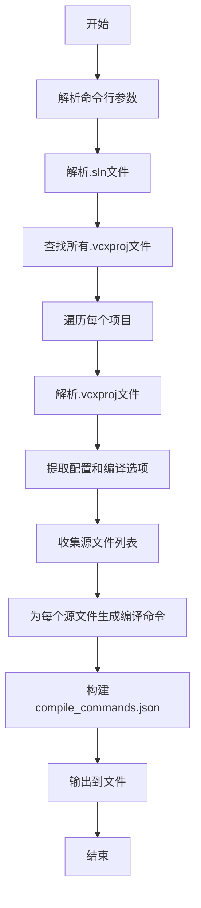
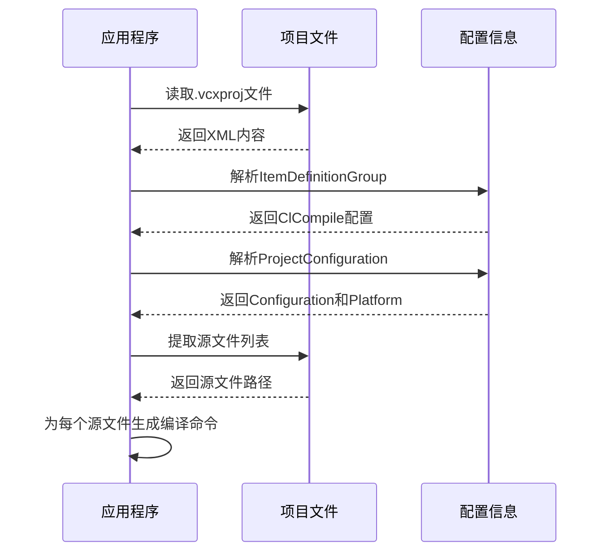

# VS项目生成compile_commands.json文档

## 项目概述

本项目是一个用Go语言编写的工具，用于从Visual Studio解决方案(.sln)文件生成`compile_commands.json`文件。这个JSON文件包含了每个源文件的编译命令，常用于支持LSP(Language Server Protocol)的编辑器和IDE，如VS Code、CLion等，以提供代码补全、跳转到定义等功能。

## 工作流程

项目从VS项目生成compile_commands.json的过程可以分为以下几个主要步骤：

1. **解析解决方案文件(.sln)**
2. **查找并解析所有项目文件(.vcxproj)**
3. **提取项目配置和编译选项**
4. **收集源文件列表**
5. **为每个源文件生成编译命令**
6. **输出compile_commands.json文件**

## 代码结构与解析

### 1. 主程序入口 (main.go)

主程序负责解析命令行参数、调用核心功能并输出结果。

```go
func main() {
    path := flag.String("s", "", "sln file path")
    configuration := flag.String("c", "Debug|Win32",
        "Configuration, [configuration|platform], default Debug|Win32")
    flag.Parse()

    // 解析解决方案文件
    solution, err := sln.NewSln(*path)
    if err != nil {
        fmt.Fprintln(os.Stderr, err)
        os.Exit(1)
    }
    
    // 生成compile_commands.json
    cmdList, err := solution.CompileCommandsJson(*configuration)
    if err != nil {
        fmt.Fprintln(os.Stderr, err)
        os.Exit(1)
    }
    
    // 输出JSON
    js, err := json.Marshal(cmdList)
    if err != nil {
        fmt.Fprintln(os.Stderr, err)
        os.Exit(1)
    }
    fmt.Printf("%s\n", js[:])
    ioutil.WriteFile("compile_commands.json", js[:], 0644)
}
```

### 2. 解决方案解析 (sln/sln.go)

负责解析.sln文件，查找所有包含的.vcxproj项目文件。

```go
func NewSln(path string) (Sln, error) {
    // 初始化解决方案结构
    // 查找所有项目文件
    projectFiles, err := findAllProject(path)
    // 解析每个项目文件
    for _, path := range projectFiles {
        pro, err := NewProject(filepath.Join(sln.SolutionDir, path))
        sln.ProjectList = append(sln.ProjectList, pro)
    }
    return sln, nil
}

// 从sln文件中提取所有vcxproj文件路径
func findAllProject(path string) ([]string, error) {
    // 使用正则表达式查找所有.vcxproj文件
    re := regexp.MustCompile("[^"]\"[^"]+\\.vcxproj\"")
    files := re.FindAllString(string(b), -1)
    // 处理结果
    return list, nil
}
```

### 3. 项目解析与编译命令生成 (sln/project.go)

负责解析.vcxproj文件，提取编译配置和源文件，并生成编译命令。

```go
// 解析项目文件
func NewProject(path string) (Project, error) {
    // 初始化项目结构
    // 读取并解析XML格式的项目文件
    err = xml.Unmarshal([]byte(data), &pro)
    return pro, nil
}

// 生成compile_commands.json内容
func (sln *Sln) CompileCommandsJson(conf string) ([]CompileCommand, error) {
    var cmdList []CompileCommand
    
    // 遍历所有项目
    for _, pro := range sln.ProjectList {
        // 遍历项目中的所有源文件
        for _, f := range pro.FindSourceFiles() {
            // 查找配置信息
            inc, def, additionalOpts, usingDirs, err := pro.FindConfigEnhanced(conf)
            // 构建编译命令
            cmdParts = append(cmdParts, "clang-cl.exe")
            cmdParts = append(cmdParts, strings.TrimSpace(allDefs)) // 预处理器定义
            cmdParts = append(cmdParts, strings.TrimSpace(allIncludeDirs)) // 包含目录
            cmdParts = append(cmdParts, allOpts) // 额外选项
            cmdParts = append(cmdParts, "-c", f) // 编译源文件
            
            item.Cmd = strings.Join(cmdParts, " ")
            cmdList = append(cmdList, item)
        }
    }
    return cmdList, nil
}
```

## 生成流程图



## 配置提取流程



## 编译命令生成规则

编译命令的生成遵循以下规则：

1. **编译器**：使用`clang-cl.exe`作为默认编译器
2. **预处理器定义**：从项目配置中提取，格式化为`-D<定义>`
3. **包含目录**：从项目配置中提取，格式化为`-I<目录>`
4. **额外选项**：从项目配置中提取AdditionalOptions字段
5. **源文件**：指定要编译的源文件路径

生成的编译命令示例：
```
clang-cl.exe -DWIN32 -D_DEBUG -I.\include -I..\external -c main.cpp
```

## 使用说明

### 命令行参数

- `-s`: 指定.sln文件路径
- `-c`: 指定配置，格式为`Configuration|Platform`，默认值为`Debug|Win32`

### 使用示例

```bash
go run main.go -s my_project.sln -c Release|x64
```

这将从`my_project.sln`文件生成Release x64配置的`compile_commands.json`文件。

## 支持的VS项目特性

- 项目属性页中的编译配置
- 预处理器定义
- 附加包含目录
- 额外编译选项
- 支持环境变量替换
- 支持Conan等包管理器的包含路径

## 环境变量替换

项目支持替换以下环境变量：

- `$(ProjectDir)`: 项目目录
- `$(Configuration)`: 当前配置
- `$(ConfigurationName)`: 当前配置名称
- `$(Platform)`: 当前平台
- 系统环境变量

## 限制与注意事项

1. 目前仅支持Visual C++项目(.vcxproj)
2. 生成的编译命令使用clang-cl.exe，可能需要根据实际环境调整
3. 部分复杂的VS项目配置可能无法完全支持
4. 环境变量替换可能不支持所有VS内置变量

## 代码优化建议

1. **增加错误处理**：增强对不支持的项目类型或配置的错误处理
2. **配置编译器**：允许用户指定使用的编译器（如cl.exe、clang.exe等）
3. **支持更多项目类型**：扩展支持C#、VB.NET等项目类型
4. **并行处理**：对于大型解决方案，考虑使用并行处理提高效率
5. **缓存机制**：添加配置缓存，避免重复解析相同的项目文件
